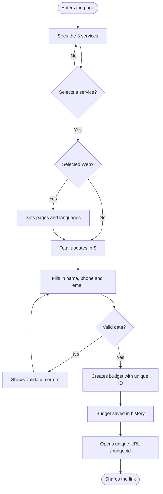

# User Flow

```mermaid
flowchart TD
    A([Enters the page]) --> B[Sees the 3 services]
    B --> C{Selects a service?}
    C -- No --> B
    C -- Yes --> D{Selected Web?}
    D -- Yes --> E[Sets pages and languages]
    D -- No --> F[Total updates in €]
    E --> F
    F --> G[Fills in name, phone and email]
    G --> H{Valid data?}
    H -- No --> I[Shows validation errors]
    I --> G
    H -- Yes --> J[Creates budget with unique ID]
    J --> K[Budget saved in history]
    K --> L[Opens unique URL /budget/id]
    L --> M([Shares the link])
```
